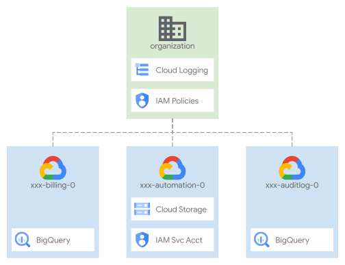

<!---
Copyright 2023 q.beyond AG
Copyright 2022 Google LLC

Licensed under the Apache License, Version 2.0 (the "License");
you may not use this file except in compliance with the License.
You may obtain a copy of the License at

     http://www.apache.org/licenses/LICENSE-2.0

Unless required by applicable law or agreed to in writing, software
distributed under the License is distributed on an "AS IS" BASIS,
WITHOUT WARRANTIES OR CONDITIONS OF ANY KIND, either express or implied.
See the License for the specific language governing permissions and
limitations under the License.
-->

# Organization bootstrap

This stage is part of the [google landing zone modules](https://github.com/qbeyond/terraform-google-landing-zone). 

The primary purpose of this stage is to enable critical organization-level functionalities that depend on broad administrative permissions, and prepare the prerequisites needed to enable automation in this and future stages.

It is intentionally simple, to minimize usage of administrative-level permissions and enable simple auditing and troubleshooting, and only deals with three sets of resources:

- project, service accounts, and GCS buckets for automation
- projects, big query datasets, and sinks for audit log and billing exports
- IAM bindings on the organization

Use the following diagram as a simple high level reference for the following sections, which describe the stage and its possible customizations in detail.

<p align="center">
  
</p>

## Design overview and choices

As mentioned above, this stage only does the bare minimum required to bootstrap automation, and ensure that base audit and billing exports are in place from the start to provide some measure of accountability, even before the security configurations are applied in a later stage.

It also sets up organization-level IAM bindings so the Organization Administrator role is only used here, trading off some design freedom for ease of auditing and troubleshooting, and reducing the risk of costly security mistakes down the line. The only exception to this rule is for the [Resource Management stage](https://github.com/qbeyond/terraform-google-landingzone-p) service account, described below.

### User groups

User groups are important, not only here but throughout the whole automation process. They provide a stable frame of reference that allows decoupling the final set of permissions for each group, from the stage where entities and resources are created and their IAM bindings defined. For example, the final set of roles for the networking group is contributed by this stage at the organization level (XPN Admin, Cloud Asset Viewer, etc.), and by the Resource Management stage at the folder level.

We have standardized the initial set of groups on those outlined in the [GCP Enterprise Setup Checklist](https://cloud.google.com/docs/enterprise/setup-checklist) to simplify adoption. They provide a comprehensive and flexible starting point that can suit most users. Adding new groups, or deviating from the initial setup is  possible and reasonably simple, and it's briefly outlined in the customization section below.

### Organization-level IAM

The service account used in the [Resource Management stage](../01-resman) needs to be able to grant specific permissions at the organizational level, to enable specific functionality for subsequent stages that deal with network or security resources, or billing-related activities.

In order to be able to assign those roles without having the full authority of the Organization Admin role, this stage defines a custom role that only allows setting IAM policies on the organization, and grants it via a [delegated role grant](https://cloud.google.com/iam/docs/setting-limits-on-granting-roles) that only allows it to be used to grant a limited subset of roles.

In this way, the Resource Management service account can effectively act as an Organization Admin, but only to grant the specific roles it needs to control.

One consequence of the above setup is the need to configure IAM bindings that can be assigned via the condition as non-authoritative, since those same roles are effectively under the control of two stages: this one and Resource Management. Using authoritative bindings for these roles (instead of non-authoritative ones) would generate potential conflicts, where each stage could try to overwrite and negate the bindings applied by the other at each `apply` cycle.

A full reference of IAM roles managed by this stage [is available here](./IAM.md).

### Automation project and resources

One other design choice worth mentioning here is using a single automation project for all foundational stages. We trade off some complexity on the API side (single source for usage quota, multiple service activation) for increased flexibility and simpler operations, while still effectively providing the same degree of separation via resource-level IAM.

### Billing account

We support three use cases in regards to billing:

- the billing account is part of this same organization, IAM bindings will be set at the organization level
- the billing account is part of a different organization, billing IAM bindings will be set at the organization level in the billing account owning organization
- the billing account is not considered part of an organization (even though it might be), billing IAM bindings are set on the billing account itself

For same-organization billing, we configure a custom organization role that can set IAM bindings, via a delegated role grant to limit its scope to the relevant roles.

For details on configuring the different billing account modes, refer to the [How to run this stage](#how-to-run-this-stage) section below.

### Organization-level logging

We create organization-level log sinks early in the bootstrap process to ensure a proper audit trail is in place from the very beginning.  By default, we provide log filters to capture [Cloud Audit Logs](https://cloud.google.com/logging/docs/audit) and [VPC Service Controls violations](https://cloud.google.com/vpc-service-controls/docs/troubleshooting#vpc-sc-errors) into a Bigquery dataset in the top-level audit project.

The [Customizations](#log-sinks-and-log-destinations) section explains how to change the logs captured and their destination.

### Naming

We are intentionally not supporting random prefix/suffixes for names, as that is an antipattern typically only used in development. It does not map to our customer's actual production usage, where they always adopt a fixed naming convention.

What is implemented here is a fairly common convention, composed of tokens ordered by relative importance:

- a static prefix less or equal to 9 characters (e.g. `myco` or `myco-gcp`)
- an environment identifier (e.g. `prod`)
- a team/owner identifier (e.g. `sec` for Security)
- a context identifier (e.g. `core` or `kms`)
- an arbitrary identifier used to distinguish similar resources (e.g. `0`, `1`)

Tokens are joined by a `-` character, making it easy to separate the individual tokens visually, and to programmatically split them in billing exports to derive initial high-level groupings for cost attribution.

The convention is used in its full form only for specific resources with globally unique names (projects, GCS buckets). Other resources adopt a shorter version for legibility, as the full context can always be derived from their project.

The [Customizations](#names-and-naming-convention) section on names below explains how to configure tokens, or implement a different naming convention.

## Workload Identity Federation and CI/CD

This stage also implements initial support for two interrelated features

- configuration of [Workload Identity Federation](https://cloud.google.com/iam/docs/workload-identity-federation) pools and providers
- configuration of CI/CD repositories to allow impersonation via Workload identity Federation, and stage running via provided workflow templates

Workload Identity Federation support allows configuring external providers independently from CI/CD, and offers predefined attributes for a few well known ones (more can be easily added by editing the `identity-providers.tf` file). Once providers have been configured their names are passed to the following stages via interface outputs, and can be leveraged to set up access or impersonation in IAM bindings.

CI/CD support is fully implemented for GitHub, Gitlab, and Cloud Source Repositories / Cloud Build. For GitHub, we also offer a [separate supporting setup](../../extras/00-cicd-github/) to quickly create / configure repositories.

<!-- TODO: add a general overview of our design -->

For details on how to configure both features, refer to the Customizations sections below on [Workload Identity Federation](#workload-identity-federation) and [CI/CD repositories](#cicd-repositories).

These features are optional and only enabled if the relevant variables have been populated.

## How to run this stage

This stage has straightforward initial requirements, as it is designed to work on newly created GCP organizations. Four steps are needed to bring up this stage:

- an Organization Admin self-assigns the required roles listed below
- the same administrator runs the first `init/apply` sequence passing a special variable to `apply`
- the providers configuration file is derived from the Terraform output or linked from the generated file
- a second `init` is run to migrate state, and from then on, the stage is run via impersonation

### Prerequisites

The roles that the Organization Admin used in the first `apply` needs to self-grant are:

- Billing Account Administrator (`roles/billing.admin`)
  either on the organization or the billing account (see the following section for details)
- Logging Admin (`roles/logging.admin`)
- Organization Role Administrator (`roles/iam.organizationRoleAdmin`)
- Organization Administrator (`roles/resourcemanager.organizationAdmin`)
- Project Creator (`roles/resourcemanager.projectCreator`)

To quickly self-grant the above roles, run the following code snippet as the initial Organization Admin:

```bash
# set variable for current logged in user
export FAST_BU=$(gcloud config list --format 'value(core.account)')

# find and set your org id
gcloud organizations list --filter display_name:$partofyourdomain
export FAST_ORG_ID=123456

# set needed roles
export FAST_ROLES="roles/billing.admin roles/logging.admin \
  roles/iam.organizationRoleAdmin roles/resourcemanager.projectCreator"

for role in $FAST_ROLES; do
  gcloud organizations add-iam-policy-binding $FAST_ORG_ID \
    --member user:$FAST_BU --role $role
done
```

Then make sure the same user is also part of the `gcp-organization-admins` group so that impersonating the automation service account later on will be possible.

#### Billing account in a different organization

If you are using a billing account belonging to a different organization (e.g. in multiple organization setups), some initial configurations are needed to ensure the identities running this stage can assign billing-related roles.

If the billing organization is managed by another version of this stage, we leverage the `organizationIamAdmin` role created there, to allow restricted granting of billing roles at the organization level.

If that's not the case, an equivalent role needs to exist, or the predefined `resourcemanager.organizationAdmin` role can be used if not managed authoritatively. The role name then needs to be manually changed in the `billing.tf` file, in the `google_organization_iam_binding` resource.

The identity applying this stage for the first time also needs two roles in billing organization, they can be removed after the first `apply` completes successfully:

```bash
export FAST_BILLING_ORG_ID=789012
export FAST_ROLES=(roles/billing.admin roles/resourcemanager.organizationAdmin)
for role in $FAST_ROLES; do
  gcloud organizations add-iam-policy-binding $FAST_BILLING_ORG_ID \
    --member user:$FAST_BU --role $role
done
```

#### Standalone billing account

If you are using a standalone billing account, the identity applying this stage for the first time needs to be a billing account administrator:

```bash
export FAST_BILLING_ACCOUNT_ID=ABCD-01234-ABCD
gcloud beta billing accounts add-iam-policy-binding $FAST_BILLING_ACCOUNT_ID \
  --member user:$FAST_BU --role roles/billing.admin
```

#### Groups

Before the first run, the following IAM groups must exist to allow IAM bindings to be created (actual names are flexible, see the [Customization](#customizations) section):

- `gcp-billing-admins`
- `gcp-devops`
- `gcp-network-admins`
- `gcp-organization-admins`
- `gcp-security-admins`

You can refer to [this animated image](./groups.gif) for a step by step on group creation.

Please note that FAST also supports an additional group for users with permissions to create support tickets and view logging and monitoring data. To remain consistent with the [Google Cloud Enterprise Checklist](https://cloud.google.com/docs/enterprise/setup-checklist) we map these permissions to the `gcp-devops` by default. However, we recommend creating a dedicated `gcp-support` group and updating the `groups` variable with the right value.

#### Configure variables

Then make sure you have configured the correct values for the following variables by providing a `terraform.tfvars` file:

- `billing_account`
  an object containing `id` as the id of your billing account, derived from the Cloud Console UI or by running `gcloud beta billing accounts list`, and `organization_id` as the id of the organization owning it, or `null` to use the billing account in isolation
- `groups`
  the name mappings for your groups, if you're following the default convention you can leave this to the provided default
- `organization.id`, `organization.domain`, `organization.customer_id`
  the id, domain and customer id of your organization, derived from the Cloud Console UI or by running `gcloud organizations list`
- `prefix`
  the fixed prefix used in your naming, maximum 9 characters long

You can also adapt the example that follows to your needs:

```tfvars
# use `gcloud beta billing accounts list`
# if you have too many accounts, check the Cloud Console :)
billing_account = {
 id              = "012345-67890A-BCDEF0"
 organization_id = 1234567890
}

# use `gcloud organizations list`
organization = {
 domain      = "example.org"
 id          = 1234567890
 customer_id = "C000001"
}

outputs_location = "~/fast-config"

# use something unique and no longer than 9 characters
prefix = "abcd"
```

### Output files and cross-stage variables

Each foundational FAST stage generates provider configurations and variable files can be consumed by the following stages, and saves them in a dedicated GCS bucket in the automation project. These files are a handy way to simplify stage configuration, and are also used by our CI/CD workflows to configure the repository files in the pipelines that validate and apply the code.

Alongisde the GCS stored files, you can also configure a second copy to be saves on the local filesystem, as a convenience when developing or bringing up the infrastructure before a proper CI/CD setup is in place.

This second set of files is disabled by default, you can enable it by setting the `outputs_location` variable to a valid path on a local filesystem, e.g.

```hcl
outputs_location = "~/fast-config"
```

Once the variable is set, `apply` will generate and manage providers and variables files, including the initial one used for this stage after the first run. You can then link these files in the relevant stages, instead of manually transfering outputs from one stage, to Terraform variables in another.

Below is the outline of the output files generated by all stages, which is identical for both the GCS and local filesystem copies:

```bash
[path specified in outputs_location]
├── providers
│   ├── 00-bootstrap-providers.tf
│   ├── 01-resman-providers.tf
│   ├── 02-networking-providers.tf
│   ├── 02-security-providers.tf
│   ├── 03-project-factory-dev-providers.tf
│   ├── 03-project-factory-prod-providers.tf
│   └── 99-sandbox-providers.tf
└── tfvars
│   ├── 00-bootstrap.auto.tfvars.json
│   ├── 01-resman.auto.tfvars.json
│   ├── 02-networking.auto.tfvars.json
│   └── 02-security.auto.tfvars.json
└── workflows
    └── [optional depending on the configured CI/CD repositories]
```

### Running the stage

Before running `init` and `apply`, check your environment so no extra variables that might influence authentication are present (e.g. `GOOGLE_IMPERSONATE_SERVICE_ACCOUNT`). In general you should use user application credentials, and FAST will then take care to provision automation identities and configure impersonation for you.

When running the first `apply` as a user, you need to pass a special runtime variable so that the user roles are preserved when setting IAM bindings.

```bash
terraform init
terraform apply \
  -var bootstrap_user=$(gcloud config list --format 'value(core.account)')
```
> If you see an error related to project name already exists, please make sure the project name is unique or the project was not deleted recently

Once the initial `apply` completes successfully, configure a remote backend using the new GCS bucket, and impersonation on the automation service account for this stage. To do this you can use the generated `providers.tf` file if you have configured output files as described above, or extract its contents from Terraform's output, then migrate state with `terraform init`:

```bash
# if using output files via the outputs_location and set to `~/fast-config`
ln -s ~/fast-config/providers/00-bootstrap* ./
# or from outputs if not using output files
terraform output -json providers | jq -r '.["00-bootstrap"]' \
  > providers.tf
# migrate state to GCS bucket configured in providers file
terraform init -migrate-state
# run terraform apply to remove the bootstrap_user iam binding 
terraform apply
```

Make sure the user you're logged in with is a member of the `gcp-organization-admins` group or impersonation will not be possible.

## Customizations

Most variables (e.g. `billing_account` and `organization`) are only used to input actual values and should be self-explanatory. The only meaningful customizations that apply here are groups, and IAM roles.

### Group names

As we mentioned above, groups reflect the convention used in the [GCP Enterprise Setup Checklist](https://cloud.google.com/docs/enterprise/setup-checklist), with an added level of indirection: the `groups` variable maps logical names to actual names, so that you don't need to delve into the code if your group names do not comply with the checklist convention.

For example, if your network admins team is called `net-rockstars@example.com`, simply set that name in the variable, minus the domain which is interpolated internally with the organization domain:

```hcl
variable "groups" {
  description = "Group names to grant organization-level permissions."
  type        = map(string)
  default = {
    gcp-network-admins      = "net-rockstars"
    # [...]
  }
}
```

If your groups layout differs substantially from the checklist, define all relevant groups in the `groups` variable, then rearrange IAM roles in the code to match your setup.

### IAM

One other area where we directly support customizations is IAM. The code here, as in all stages, follows a simple pattern derived from best practices:

- operational roles for humans are assigned to groups
- any other principal is a service account

In code, the distinction above reflects on how IAM bindings are specified in the underlying module variables:

- group roles "for humans" always use `iam_groups` variables
- service account roles always use `iam` variables

This makes it easy to tweak user roles by adding mappings to the `iam_groups` variables of the relevant resources, without having to understand and deal with the details of service account roles.

In those cases where roles need to be assigned to end-user service accounts (e.g. an application or pipeline service account), we offer a stage-level `iam` variable that allows pinpointing individual role/members pairs, without having to touch the code internals, to avoid the risk of breaking a critical role for a robot account. The variable can also be used to assign roles to specific users or to groups external to the organization, e.g. to support external suppliers.

The one exception to this convention is for roles which are part of the delegated grant condition described above, and which can then be assigned from other stages. In this case, use the `iam_additive` variable as they are implemented with non-authoritative resources. Using non-authoritative bindings ensure that re-executing this stage will not override any bindings set in downstream stages.

A full reference of IAM roles managed by this stage [is available here](./IAM.md).

### Log sinks and log destinations

You can customize organization-level logs through the `log_sinks` variable in two ways:

- creating additional log sinks to capture more logs
- changing the destination of captured logs

By default, all logs are exported to Bigquery, but FAST can create sinks to Cloud Logging Buckets, GCS, or PubSub.

If you need to capture additional logs, please refer to GCP's documentation on [scenarios for exporting logging data](https://cloud.google.com/architecture/exporting-stackdriver-logging-for-security-and-access-analytics), where you can find ready-made filter expressions for different use cases.

### Names and naming convention

Configuring the individual tokens for the naming convention described above, has varying degrees of complexity:

- the static prefix can be set via the `prefix` variable once
- the environment identifier is set to `prod` as resources here influence production and are considered as such, and can be changed in `main.tf` locals

All other tokens are set directly in resource names, as providing abstractions to manage them would have added too much complexity to the code, making it less readable and more fragile.

If a different convention is needed, identify names via search/grep (e.g. with `^\s+name\s+=\s+"`) and change them in an editor: it should take a couple of  minutes at most, as there's just a handful of modules and resources to change.

Names used in internal references (e.g. `module.foo-prod.id`) are only used by Terraform and do not influence resource naming, so they are best left untouched to avoid having to debug complex errors.

### Workload Identity Federation

At any time during this stage's lifecycle you can configure a Workload Identity Federation pool, and one or more providers. These are part of this stage's interface, included in the automatically generated `.tfvars` files and accepted by the Resource Managent stage that follows.

The variable maps each provider's `issuer` attribute with the definitions in the `identity-providers.tf` file. We currently support GitHub and Gitlab directly, and extending to definitions to support more providers is trivial (send us a PR if you do!).

Provider key names are used by the `cicd_repositories` variable to configure authentication for CI/CD repositories, and generally from your Terraform code whenever you need to configure IAM access or impersonation for federated identities.

This is a sample configuration of a GitHub and a Gitlab provider, `attribute_condition` attribute can use any of the mapped attribute for the provider (refer to the `identity-providers.tf` file for the full list) or set to `null` if needed:

```hcl
federated_identity_providers = {
  github-sample = {
    attribute_condition = "attribute.repository_owner==\"my-github-org\""
    issuer              = "github"
    custom_settings     = null
  }
  gitlab-sample = {
    attribute_condition = "attribute.namespace_path==\"my-gitlab-org\""
    issuer              = "gitlab"
    custom_settings     = null
  }
  gitlab-ce-sample = {
    attribute_condition = "attribute.namespace_path==\"my-gitlab-org\""
    issuer              = "gitlab"
    custom_settings     = {
      issuer_uri          = "https://gitlab.fast.example.com"
      allowed_audiences   = ["https://gitlab.fast.example.com"]
    }
  }
}
```

### CI/CD repositories

FAST is designed to directly support running in automated workflows from separate repositories for each stage. The `cicd_repositories` variable allows you to configure impersonation from external repositories leveraging Workload identity Federation, and pre-configures a FAST workflow file that can be used to validate and apply the code in each repository.

The repository design we support is fairly simple, with a repository for modules that enables centralization and versioning, and one repository for each stage optionally configured from the previous stage.

This is an example of configuring the bootstrap and resource management repositories in this stage. CI/CD configuration is optional, so the entire variable or any of its attributes can be set to null if not needed.

```hcl
cicd_repositories = {
  bootstrap = {
    branch            = null
    identity_provider = "github-sample"
    name              = "my-gh-org/fast-bootstrap"
    type              = "github"
  }
  cicd = {
    branch            = null
    identity_provider = "github-sample"
    name              = "my-gh-org/fast-cicd"
    type              = "github"
  }
  resman = {
    branch            = "main"
    identity_provider = "github-sample"
    name              = "my-gh-org/fast-resman"
    type              = "github"
  }
}
```

The `type` attribute can be set to one of the supported repository types: `github`, `gitlab`, or `sourcerepo`.

Once the stage is applied the generated output files will contain pre-configured workflow files for each repository, that will use Workload Identity Federation via a dedicated service account for each repository to impersonate the automation service account for the stage.

You can use Terraform to automate creation of the repositories using the extra stage defined in [fast/extras/00-cicd-github](../../extras/00-cicd-github/) (only for Github for now).

The remaining configuration is manual, as it regards the repositories themselves:

- create a repository for modules
  - clone and populate it with the Fabric modules
  - configure authentication to the modules repository
    - for GitHub
      - create a key pair
      - create a [deploy key](https://docs.github.com/en/developers/overview/managing-deploy-keys#deploy-keys) in the modules repository with the public key
      - create a `CICD_MODULES_KEY` secret with the private key in each of the repositories that need to access modules (for Gitlab, please Base64 encode the private key for masking)
    - for Gitlab
      - TODO
    - for Source Repositories
      - assign the reader role to the CI/CD service accounts
- create one repository for each stage
  - clone and populate them with the stage source
  - edit the modules source to match your modules repository
    - a simple way is using the "Replace in files" function of your editor
      - search for `source\s*= "../../../modules/([^"]+)"`
      - replace with `source = "git@github.com:my-org/fast-modules.git//$1?ref=v1.0"`
  - copy the generated workflow file for the stage from the GCS output files bucket or from the local clone if enabled
    - for GitHub, place it in a `.github/workflows` folder in the repository root
    - for Gitlab, rename it to `.gitlab-ci.yml` and place it in the repository root
    - for Source Repositories, place it in `.cloudbuild/workflow.yaml`

<!-- BEGIN_TF_DOCS -->
## Requirements

No requirements.

## Inputs

| Name | Description | Type | Default | Required |
|------|-------------|------|---------|:--------:|
| <a name="input_billing_account"></a> [billing\_account](#input\_billing\_account) | Billing account id and organization id ('nnnnnnnn' or null). | <pre>object({<br>    id              = string<br>    organization_id = number<br>  })</pre> | n/a | yes |
| <a name="input_organization"></a> [organization](#input\_organization) | Organization details. | <pre>object({<br>    domain      = string<br>    id          = number<br>    customer_id = string<br>  })</pre> | n/a | yes |
| <a name="input_prefix"></a> [prefix](#input\_prefix) | Prefix used for resources that need unique names. Use 9 characters or less. | `string` | n/a | yes |
| <a name="input_bootstrap_user"></a> [bootstrap\_user](#input\_bootstrap\_user) | Email of the nominal user running this stage for the first time. | `string` | `null` | no |
| <a name="input_cicd_repositories"></a> [cicd\_repositories](#input\_cicd\_repositories) | CI/CD repository configuration. Identity providers reference keys in the `federated_identity_providers` variable. Set to null to disable, or set individual repositories to null if not needed. | <pre>object({<br>    bootstrap = object({<br>      branch            = string<br>      identity_provider = string<br>      name              = string<br>      type              = string<br>    })<br>    cicd = object({<br>      branch            = string<br>      identity_provider = string<br>      name              = string<br>      type              = string<br>    })<br>    resman = object({<br>      branch            = string<br>      identity_provider = string<br>      name              = string<br>      type              = string<br>    })<br>  })</pre> | `null` | no |
| <a name="input_custom_role_names"></a> [custom\_role\_names](#input\_custom\_role\_names) | Names of custom roles defined at the org level. | <pre>object({<br>    organization_iam_admin        = string<br>    service_project_network_admin = string<br>  })</pre> | <pre>{<br>  "organization_iam_admin": "organizationIamAdmin",<br>  "service_project_network_admin": "serviceProjectNetworkAdmin"<br>}</pre> | no |
| <a name="input_fast_features"></a> [fast\_features](#input\_fast\_features) | Selective control for top-level FAST features. | <pre>object({<br>    data_platform   = bool<br>    gke             = bool<br>    project_factory = bool<br>    sandbox         = bool<br>    teams           = bool<br>  })</pre> | <pre>{<br>  "data_platform": true,<br>  "gke": true,<br>  "project_factory": true,<br>  "sandbox": true,<br>  "teams": true<br>}</pre> | no |
| <a name="input_federated_identity_providers"></a> [federated\_identity\_providers](#input\_federated\_identity\_providers) | Workload Identity Federation pools. The `cicd_repositories` variable references keys here. | <pre>map(object({<br>    attribute_condition = string<br>    issuer              = string<br>    custom_settings = object({<br>      issuer_uri        = string<br>      allowed_audiences = list(string)<br>    })<br>  }))</pre> | `{}` | no |
| <a name="input_groups"></a> [groups](#input\_groups) | Group names to grant organization-level permissions. | `map(string)` | <pre>{<br>  "gcp-billing-admins": "gcp-billing-admins",<br>  "gcp-devops": "gcp-devops",<br>  "gcp-network-admins": "gcp-network-admins",<br>  "gcp-organization-admins": "gcp-organization-admins",<br>  "gcp-security-admins": "gcp-security-admins",<br>  "gcp-support": "gcp-devops"<br>}</pre> | no |
| <a name="input_iam"></a> [iam](#input\_iam) | Organization-level custom IAM settings in role => [principal] format. | `map(list(string))` | `{}` | no |
| <a name="input_iam_additive"></a> [iam\_additive](#input\_iam\_additive) | Organization-level custom IAM settings in role => [principal] format for non-authoritative bindings. | `map(list(string))` | `{}` | no |
| <a name="input_locations"></a> [locations](#input\_locations) | Optional locations for GCS, BigQuery, and logging buckets created here. | <pre>object({<br>    bq      = string<br>    gcs     = string<br>    logging = string<br>    pubsub  = list(string)<br>  })</pre> | <pre>{<br>  "bq": "EU",<br>  "gcs": "EU",<br>  "logging": "global",<br>  "pubsub": []<br>}</pre> | no |
| <a name="input_log_sinks"></a> [log\_sinks](#input\_log\_sinks) | Org-level log sinks, in name => {type, filter} format. | <pre>map(object({<br>    filter = string<br>    type   = string<br>  }))</pre> | <pre>{<br>  "audit-logs": {<br>    "filter": "logName:\"/logs/cloudaudit.googleapis.com%2Factivity\" OR logName:\"/logs/cloudaudit.googleapis.com%2Fsystem_event\"",<br>    "type": "bigquery"<br>  },<br>  "vpc-sc": {<br>    "filter": "protoPayload.metadata.@type=\"type.googleapis.com/google.cloud.audit.VpcServiceControlAuditMetadata\"",<br>    "type": "bigquery"<br>  }<br>}</pre> | no |
| <a name="input_outputs_location"></a> [outputs\_location](#input\_outputs\_location) | Enable writing provider, tfvars and CI/CD workflow files to local filesystem. Leave null to disable. | `string` | `null` | no |
| <a name="input_project_parent_ids"></a> [project\_parent\_ids](#input\_project\_parent\_ids) | Optional parents for projects created here in folders/nnnnnnn format. Null values will use the organization as parent. | <pre>object({<br>    automation = string<br>    billing    = string<br>    logging    = string<br>  })</pre> | <pre>{<br>  "automation": null,<br>  "billing": null,<br>  "logging": null<br>}</pre> | no |
## Outputs

| Name | Description |
|------|-------------|
| <a name="output_automation"></a> [automation](#output\_automation) | Automation resources. |
| <a name="output_billing_dataset"></a> [billing\_dataset](#output\_billing\_dataset) | BigQuery dataset prepared for billing export. |
| <a name="output_cicd_repositories"></a> [cicd\_repositories](#output\_cicd\_repositories) | CI/CD repository configurations. |
| <a name="output_custom_roles"></a> [custom\_roles](#output\_custom\_roles) | Organization-level custom roles. |
| <a name="output_federated_identity"></a> [federated\_identity](#output\_federated\_identity) | Workload Identity Federation pool and providers. |
| <a name="output_outputs_bucket"></a> [outputs\_bucket](#output\_outputs\_bucket) | GCS bucket where generated output files are stored. |
| <a name="output_project_ids"></a> [project\_ids](#output\_project\_ids) | Projects created by this stage. |
| <a name="output_providers"></a> [providers](#output\_providers) | Terraform provider files for this stage and dependent stages. |
| <a name="output_service_accounts"></a> [service\_accounts](#output\_service\_accounts) | Automation service accounts created by this stage. |
| <a name="output_tfvars"></a> [tfvars](#output\_tfvars) | Terraform variable files for the following stages. |

## Resource types

| Type | Used |
|------|-------|
| [google-beta_google_iam_workload_identity_pool](https://registry.terraform.io/providers/hashicorp/google-beta/latest/docs/resources/google_iam_workload_identity_pool) | 1 |
| [google-beta_google_iam_workload_identity_pool_provider](https://registry.terraform.io/providers/hashicorp/google-beta/latest/docs/resources/google_iam_workload_identity_pool_provider) | 1 |
| [google_billing_account_iam_member](https://registry.terraform.io/providers/hashicorp/google/latest/docs/resources/billing_account_iam_member) | 2 |
| [google_organization_iam_binding](https://registry.terraform.io/providers/hashicorp/google/latest/docs/resources/organization_iam_binding) | 2 |
| [google_storage_bucket_object](https://registry.terraform.io/providers/hashicorp/google/latest/docs/resources/storage_bucket_object) | 4 |
| [local_file](https://registry.terraform.io/providers/hashicorp/local/latest/docs/resources/file) | 4 |

**`Used` only includes resource blocks.** `for_each` and `count` meta arguments, as well as resource blocks of modules are not considered.

## Modules

| Name | Source | Version |
|------|--------|---------|
| <a name="module_automation-project"></a> [automation-project](#module\_automation-project) | qbeyond/project/google | 0.1.0 |
| <a name="module_automation-tf-bootstrap-gcs"></a> [automation-tf-bootstrap-gcs](#module\_automation-tf-bootstrap-gcs) | qbeyond/storage-bucket/google | 0.1.0 |
| <a name="module_automation-tf-bootstrap-sa"></a> [automation-tf-bootstrap-sa](#module\_automation-tf-bootstrap-sa) | qbeyond/service-account/google | 0.1.0 |
| <a name="module_automation-tf-cicd-gcs"></a> [automation-tf-cicd-gcs](#module\_automation-tf-cicd-gcs) | qbeyond/storage-bucket/google | 0.1.0 |
| <a name="module_automation-tf-cicd-provisioning-sa"></a> [automation-tf-cicd-provisioning-sa](#module\_automation-tf-cicd-provisioning-sa) | qbeyond/service-account/google | 0.1.0 |
| <a name="module_automation-tf-cicd-repo"></a> [automation-tf-cicd-repo](#module\_automation-tf-cicd-repo) | qbeyond/source-repository/google | 0.1.0 |
| <a name="module_automation-tf-cicd-sa"></a> [automation-tf-cicd-sa](#module\_automation-tf-cicd-sa) | qbeyond/service-account/google | 0.1.0 |
| <a name="module_automation-tf-output-gcs"></a> [automation-tf-output-gcs](#module\_automation-tf-output-gcs) | qbeyond/storage-bucket/google | 0.1.0 |
| <a name="module_automation-tf-resman-gcs"></a> [automation-tf-resman-gcs](#module\_automation-tf-resman-gcs) | qbeyond/storage-bucket/google | 0.1.0 |
| <a name="module_automation-tf-resman-sa"></a> [automation-tf-resman-sa](#module\_automation-tf-resman-sa) | qbeyond/service-account/google | 0.1.0 |
| <a name="module_billing-export-dataset"></a> [billing-export-dataset](#module\_billing-export-dataset) | ./modules/bigquery-dataset | n/a |
| <a name="module_billing-export-project"></a> [billing-export-project](#module\_billing-export-project) | qbeyond/project/google | 0.1.0 |
| <a name="module_billing-organization-ext"></a> [billing-organization-ext](#module\_billing-organization-ext) | qbeyond/organization-configuration/google | 0.1.0 |
| <a name="module_bootstrap_template"></a> [bootstrap\_template](#module\_bootstrap\_template) | qbeyond/landing-zone/google//modules/provider-template | 0.1.0 |
| <a name="module_cicd_template"></a> [cicd\_template](#module\_cicd\_template) | qbeyond/landing-zone/google//modules/provider-template | 0.1.0 |
| <a name="module_log-export-dataset"></a> [log-export-dataset](#module\_log-export-dataset) | ./modules/bigquery-dataset | n/a |
| <a name="module_log-export-gcs"></a> [log-export-gcs](#module\_log-export-gcs) | qbeyond/storage-bucket/google | 0.1.0 |
| <a name="module_log-export-logbucket"></a> [log-export-logbucket](#module\_log-export-logbucket) | ./modules/logging-bucket | n/a |
| <a name="module_log-export-project"></a> [log-export-project](#module\_log-export-project) | qbeyond/project/google | 0.1.0 |
| <a name="module_log-export-pubsub"></a> [log-export-pubsub](#module\_log-export-pubsub) | ./modules/pubsub | n/a |
| <a name="module_organization"></a> [organization](#module\_organization) | qbeyond/organization-configuration/google | 0.1.0 |
| <a name="module_resman_template"></a> [resman\_template](#module\_resman\_template) | qbeyond/landing-zone/google//modules/provider-template | 0.1.0 |

## Resources by Files

### billing.tf

| Name | Type |
|------|------|
| [google_billing_account_iam_member.billing_ext_admin](https://registry.terraform.io/providers/hashicorp/google/latest/docs/resources/billing_account_iam_member) | resource |
| [google_billing_account_iam_member.billing_ext_cost_manager](https://registry.terraform.io/providers/hashicorp/google/latest/docs/resources/billing_account_iam_member) | resource |
| [google_organization_iam_binding.billing_org_ext_admin_delegated](https://registry.terraform.io/providers/hashicorp/google/latest/docs/resources/organization_iam_binding) | resource |

### identity-providers.tf

| Name | Type |
|------|------|
| [google-beta_google_iam_workload_identity_pool.default](https://registry.terraform.io/providers/hashicorp/google-beta/latest/docs/resources/google_iam_workload_identity_pool) | resource |
| [google-beta_google_iam_workload_identity_pool_provider.default](https://registry.terraform.io/providers/hashicorp/google-beta/latest/docs/resources/google_iam_workload_identity_pool_provider) | resource |

### organization.tf

| Name | Type |
|------|------|
| [google_organization_iam_binding.org_admin_delegated](https://registry.terraform.io/providers/hashicorp/google/latest/docs/resources/organization_iam_binding) | resource |

### outputs-files.tf

| Name | Type |
|------|------|
| [local_file.providers](https://registry.terraform.io/providers/hashicorp/local/latest/docs/resources/file) | resource |
| [local_file.tfvars](https://registry.terraform.io/providers/hashicorp/local/latest/docs/resources/file) | resource |
| [local_file.tfvars_globals](https://registry.terraform.io/providers/hashicorp/local/latest/docs/resources/file) | resource |
| [local_file.workflows](https://registry.terraform.io/providers/hashicorp/local/latest/docs/resources/file) | resource |

### outputs-gcs.tf

| Name | Type |
|------|------|
| [google_storage_bucket_object.providers](https://registry.terraform.io/providers/hashicorp/google/latest/docs/resources/storage_bucket_object) | resource |
| [google_storage_bucket_object.tfvars](https://registry.terraform.io/providers/hashicorp/google/latest/docs/resources/storage_bucket_object) | resource |
| [google_storage_bucket_object.tfvars_globals](https://registry.terraform.io/providers/hashicorp/google/latest/docs/resources/storage_bucket_object) | resource |
| [google_storage_bucket_object.workflows](https://registry.terraform.io/providers/hashicorp/google/latest/docs/resources/storage_bucket_object) | resource |
## Contribute

This repository is derived from [google cloud foundation fabric v19](https://github.com/GoogleCloudPlatform/cloud-foundation-fabric/tree/v19.0.0).
<!-- END_TF_DOCS -->

## Destruction

If you want to destroy a previous FAST deployment in your organization, you need to destroy in reverse order. So to destroy this module, you need to destroy all subsequent stages before.

**Warning: you should follow these steps carefully as we will modify our own permissions. Ensure you can grant yourself the Organization Admin role again. Otherwise, you will not be able to finish the destruction process and will, most likely, get locked out of your organization.**

We manually remove several resources (GCS buckets and BQ datasets). Note that `terrafom destroy` will fail. This is expected; just continue with the rest of the steps.

```powershell
cd $FAST_PWD/00-bootstrap/

# remove provider config to execute without SA impersonation
rm 00-bootstrap-providers.tf

#override project to use cloud identity api
Set-Content -LiteralPath "00-bootstrap-providers-destroy.tf" -Value @(
  'provider "google" {'
  'billing_project = "<iacproject>"'
  'user_project_override = true'
  '}'
)

# migrate to local state
terraform init -migrate-state

# remove GCS buckets
terraform state list | Select-String "google_storage_bucket\." | Foreach-Object {$_ = $_ -replace '"','\"'; & terraform state rm $_}

#remove bigqueries
terraform state list | Select-String "google_bigquery_dataset" | Foreach-Object {$_ = $_ -replace '"','\"'; & terraform state rm $_}

terraform destroy
```

When the destroy fails, continue with the steps below. Again, make sure your user (the one you are using to execute this step) has the Organization Administrator role, as we will remove the permissions for the organization-admins group

```powershell
# Add the Organization Admin role to $BU_USER in the GCP Console
# then execute the command below to grant yourself the permissions needed 
# to finish the destruction
$FAST_DESTROY_ROLES=@(
  "roles/billing.admin",
  "roles/logging.admin",
  "roles/iam.organizationRoleAdmin",
  "roles/resourcemanager.projectDeleter",
  "roles/resourcemanager.folderAdmin",
  "roles/owner"
)

# login to gcloud
gcloud auth login

$FAST_BU=gcloud config list --format 'value(core.account)'

# find your org id
gcloud organizations list --filter display_name:[part of your domain]

# set your org id
$FAST_ORG_ID="<orgid>"

foreach ($role in $FAST_DESTROY_ROLES) {
gcloud organizations add-iam-policy-binding $FAST_ORG_ID --member user:$FAST_BU --role $role
}

terraform destroy
rm -i terraform.tfstate*
```

In case you want to deploy FAST stages again, the make sure to:
* Modify the [prefix](00-bootstrap/variables.tf) variable to allow the deployment of resources that need unique names (eg, projects).
* Modify the [custom_roles](00-bootstrap/variables.tf) variable to allow recently deleted custom roles to be created again.
